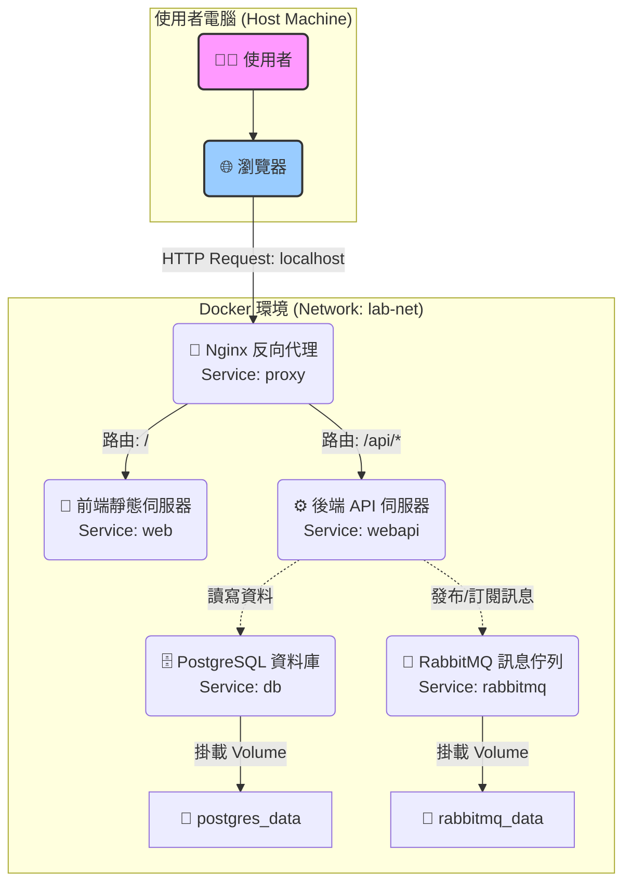

# WSL Docker 實驗專案 (WSL Docker Lab)

這是一個簡單的 Web 應用程式專案，旨在展示如何使用 Docker on WSL (Windows Subsystem for Linux) 來建置一個包含前端和後端服務的環境。

## 專案目的

此專案的主要目的是作為一個學習範例，展示：

*   在 WSL 環境中進行開發。
*   使用 Docker Compose 管理多個容器服務。
*   設置一個 Nginx 容器作為反向代理 (Reverse Proxy)。
*   一個提供靜態網頁的前端服務 (`web`)。
*   一個提供 API 的後端服務 (`api`)。

## 專案架構 (推斷)

根據 `index.html` 的內容，推斷專案可能包含以下結構：

```
.
├── api/
│   └── ... (後端應用程式，例如 Node.js/Python/Go)
├── web/
│   └── index.html (前端靜態頁面)
├── nginx/
│   └── default.conf (Nginx 反向代理設定)
└── docker-compose.yml
```

*   **`api/`**: 包含後端 API 服務的原始碼。
*   **`web/`**: 包含前端靜態檔案 (`index.html`)。
*   **`nginx/`**: 包含 Nginx 反向代理的設定檔，它會將 `/` 的請求指向 `web` 服務，並將 `/api` 的請求轉發到 `api` 服務。
*   **`docker-compose.yml`**: 定義和運行整個應用程式的服務、網路和磁碟區。

## 系統架構圖

此專案的服務都運行在 Docker 容器中，並透過 `lab-net` 網路進行通訊。使用者請求的流程如下：



## 環境需求

*   Windows 10/11
*   WSL 2 (Windows Subsystem for Linux)
*   在 WSL 2 中安裝 Docker Engine 及 Docker Compose。

## 如何開始

1.  **Clone 專案**
    ```bash
    git clone https://github.com/<your-username>/<your-repo-name>.git
    cd <your-repo-name>
    ```

2.  **設定環境變數**
    專案依賴環境變數來設定資料庫與 RabbitMQ 的帳號密碼。請複製 `.env.example` (如果有的話) 或手動建立 `.env` 檔案，並填入以下內容：
    ```.env
    POSTGRES_USER=admin
    POSTGRES_PASSWORD=your_strong_password
    POSTGRES_DB=lab_db
    RABBITMQ_DEFAULT_USER=guest
    RABBITMQ_DEFAULT_PASS=guest
    ```

3.  **啟動服務**
    在專案根目錄下，執行以下指令來建置並啟動所有容器 ( `-d` 參數表示在背景執行)：
    ```bash
    docker-compose up -d
    ```

4.  **訪問應用程式**
    根據 `docker-compose.yml` 的設定，您可以透過以下方式訪問各個服務：
    *   **前端頁面**: 打開瀏覽器並訪問 `http://localhost`。
    *   **後端 API**: 任何發送到 `http://localhost/api/` 的請求都會被轉發到後端 echo 伺服器。例如：`http://localhost/api/hello-world`。
    *   **RabbitMQ 管理介面**: 訪問 `http://localhost:15672`。
    *   **資料庫連線**: 使用您喜歡的資料庫客戶端工具，連線到 `localhost`，Port 為 `5432`。

5.  **停止服務**
    若要停止並移除所有容器，請執行：
    ```bash
    docker-compose down
    ```
